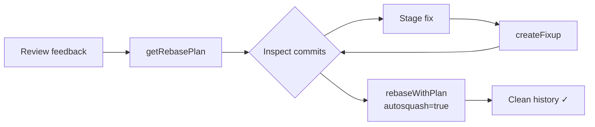
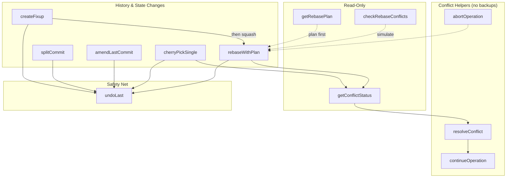

# git-hex


[](https://github.com/yaniv-golan/git-hex/actions/workflows/test.yml)
[](https://github.com/yaniv-golan/git-hex/actions/workflows/lint.yml)
[](LICENSE)
[](SECURITY.md)
[](https://github.com/yaniv-golan/git-hex/commits/main)
[](https://www.gnu.org/software/bash/)
[](https://modelcontextprotocol.io/)

**AI-assisted, non-interactive git refactoring via MCP** — a focused toolset for rebase & commit perfection, usable by agents or chat users directing the MCP tools.

git-hex is an MCP (Model Context Protocol) server that provides AI assistants with safe, powerful git refactoring capabilities. It handles the complexity of interactive rebasing, fixup commits, and commit amendments while ensuring your repository is never left in a broken state.

Name note: “git-hex” is simply a short label for this git-history refactoring toolkit (not related to hex encoding).

See [`CHANGELOG.md`](CHANGELOG.md) for notable changes. Version metadata also lives in [`VERSION`](VERSION) and [`.claude-plugin/plugin.json`](.claude-plugin/plugin.json).

**Quick links:** [`docs/install.md`](docs/install.md) • [`docs/safety.md`](docs/safety.md) • [`docs/clients.md`](docs/clients.md) • [`docs/reference/tools.md`](docs/reference/tools.md) • [`docs/reference/mcp.md`](docs/reference/mcp.md) • [`SECURITY.md`](SECURITY.md) • [`CONTRIBUTING.md`](CONTRIBUTING.md)

## Table of contents

- [Quick Start](#quick-start-2-minutes)
- [Safety First](#safety-first)
- [How it works](#how-it-works)
- [Common workflows](#common-workflows)
- [Tool reference](#tool-reference)
- [CLI testing/debugging](#cli-testingdebugging)
- [Support](#support)
- [Security](#security)

## Design Principles

- **Safety first**: Conflict-prone operations abort cleanly by default and create backup refs so you can always undo.
- **Deterministic git**: Focus on well-defined history rewrites (rebase, fixup, amend, split-by-file) with predictable outputs.
- **Minimal surface**: Tools only—no extra services. Everything runs through the MCP Bash Framework.
- **Respect the sandbox**: Every path is validated against your client’s allowed folders (MCP `roots`); read-only mode blocks mutating tools.
- **Agent friendly**: Outputs are structured, include summaries, and prefer explicit parameters over magic.

## Features

- **Safe Rebasing**: Automatic abort on conflicts so git-hex operations leave the repo clean if conflicts arise
- **Fixup Commits**: Create fixup! commits for later auto-squashing
- **Commit Amendments**: Safely amend the last commit with staged changes
- **Cherry-picking**: Single-commit cherry-pick with strategy options
- **Undo Support**: Backup refs for history-mutating operations (amend, fixup, cherry-pick, rebase, split); undo is safe unless new commits were added after the backup (see `force`)
- **Path Security**: All operations respect your client’s allowed folders (MCP `roots`) for sandboxed access

## Quick Start (2 minutes)

### 1) Clone

```bash
git clone https://github.com/yaniv-golan/git-hex.git ~/git-hex
```

### 2) Connect your AI

**Claude Code (recommended):**
```text
/plugin marketplace add ~/git-hex
/plugin install git-hex@git-hex-marketplace
```

**Cursor / Claude Desktop / Windsurf (MCP config):**
```json
{
  "mcpServers": {
    "git-hex": {
      "command": "/path/to/git-hex/git-hex.sh"
    }
  }
}
```

Windows (Git Bash): see [`docs/clients.md#windows-git-bash`](docs/clients.md#windows-git-bash)

Prerequisites auto-install on first run; see [`docs/install.md`](docs/install.md).

### 3) First success

In your AI chat (in a repo), ask:

> “Show me the last 5 commits I could rebase onto `main`.”

When connected, your AI can use tools like `git-hex-getRebasePlan` to answer.

<details>
<summary>Having issues?</summary>

- Diagnostics (no persistent changes): `./git-hex.sh doctor`
- Install/repair prerequisites: `./git-hex.sh doctor --fix`
- On first run you may see framework installation output; this is normal.
- macOS apps launched from Finder/Spotlight/Dock: use `git-hex-env.sh` (see [`docs/clients.md`](docs/clients.md))
- Install/uninstall details: [`docs/install.md`](docs/install.md)
- Allowed folders (“roots”) explanation: [`docs/concepts.md`](docs/concepts.md#allowed-folders-mcp-roots)

</details>

## Safety First

- **Allowed folders enforcement**: repo paths must be inside configured allowed folders (MCP `roots`).
- **Backups for mutations**: every history-mutating tool creates `refs/git-hex/backup/...` so you can recover.
- **Conflict safety**: rebases/cherry-picks abort and restore by default on conflicts.
- **Read-only mode**: set `GIT_HEX_READ_ONLY=1` to block all mutating tools.
- **Scoped guarantees**: git-hex tools do not run `git push/fetch/pull`; dependency installation may use the network unless you preinstall/pin it.

Details: [`docs/safety.md`](docs/safety.md)

### Next: 30-second end-to-end example (mutates history)

1. Stage a fix: `git add <files>`
2. In your AI chat, ask it to create a fixup targeting a commit, then autosquash onto `main`
   - Tools involved: `git-hex-createFixup` → `git-hex-rebaseWithPlan` (with `autosquash=true`)

## How It Works

### Feature Branch Cleanup Workflow

The typical git-hex workflow for cleaning up a feature branch after code review:



### Tool Overview



All history-mutating operations create backup refs, enabling `undoLast` to restore the previous state. Conflict-resolution helpers (`resolveConflict`, `continueOperation`, etc.) do not create backups.

## Requirements

| Dependency | Version/Notes |
|------------|---------------|
| MCP Bash Framework (`mcp-bash`) | v0.8.0+ |
| bash | 3.2+ |
| jq or gojq | Required for full mode |
| git | 2.20+ (2.33+ for `ort`, 2.38+ for `git-hex-checkRebaseConflicts`) |

## Configuration

### Required

| Variable | Description |
|----------|-------------|
| `MCPBASH_PROJECT_ROOT` | Project root containing `tools/`. **Auto-set** by `git-hex.sh` and generated wrappers; required only if you invoke `mcp-bash` directly from outside the repo. |

### Optional

| Variable | Default | Description |
|----------|---------|-------------|
| `GIT_HEX_READ_ONLY` | unset | `1` blocks mutating tools (see [`docs/safety.md`](docs/safety.md)) |
| `GIT_HEX_AUTO_INSTALL_FRAMEWORK` | `true` | If `true`, `git-hex.sh` auto-installs the pinned MCP Bash Framework when missing. Set to `false` to require a preinstalled framework (or use `git-hex-env.sh`). |
| `GIT_HEX_MCPBASH_SHA256` | unset | If set, `git-hex.sh` downloads the `FRAMEWORK_VERSION` tarball and verifies it against this checksum (fails on mismatch) instead of cloning. |
| `GIT_HEX_MCPBASH_ARCHIVE_URL` | unset | Optional override for the tarball URL used when `GIT_HEX_MCPBASH_SHA256` is set. |
| `MCPBASH_TOOL_ALLOWLIST` | (set by launchers) | Framework v0.7.0+: allowlisted tools may execute. The launchers set an explicit list of git-hex tool names by default (and narrow it in read-only mode). Override to `*` only for trusted environments. |

### Completions

git-hex ships completion providers (refs, commits, conflict paths) registered declaratively via `server.d/register.json`. Completions are available in full mode (jq/gojq required).

> **Tip:** Running `mcp-bash` outside this repo without `MCPBASH_PROJECT_ROOT` starts the framework’s getting-started helper, not git-hex. Use `./git-hex.sh` (CLI) or `./git-hex-env.sh` (macOS apps launched from Finder/Spotlight/Dock; see `docs/clients.md`) when launching from other directories or GUI clients.

## Versioning & Releases

- Current development version: `0.1.0` (see `VERSION`).
- We plan to publish GitHub Releases with signed tags, release notes, and checksums for verification. Until those are published, pin a specific commit for reproducibility (e.g., `git checkout <commit-sha>`).

## Lint & Tests

- Lint shell scripts: `./test/lint.sh`
- Run all tests: `./test/run.sh` (or `./test/integration/run.sh` / `./test/security/run.sh`)
- Optional pre-commit hook to auto-run lint: `git config core.hooksPath .githooks`
- Contributors: see [`CONTRIBUTING.md`](CONTRIBUTING.md) for `./git-hex.sh validate` and the full workflow

## Installation

Start here: [`docs/install.md`](docs/install.md) (includes `doctor --fix` behavior, verified framework installs, and uninstall/cleanup).

```bash
git clone https://github.com/yaniv-golan/git-hex.git ~/git-hex
cd ~/git-hex
./git-hex.sh doctor
./git-hex.sh doctor --fix
```

## Clients & plugin

See [`docs/clients.md`](docs/clients.md) for Claude Code plugin setup, MCP client configuration (Cursor/Windsurf/Claude Desktop/CLI), and launcher guidance.

## Common Workflows

These examples show how to combine git-hex tools for typical development tasks.

### Clean Up a Feature Branch After Code Review

After receiving review feedback, create targeted fixups and squash them:

```
1. Review current commits
   → git-hex-getRebasePlan { "onto": "main" }
   
2. For each piece of feedback:
   - Make the fix in your editor
   - Stage the changes: git add <files>
   - Create a fixup targeting the original commit:
     → git-hex-createFixup { "commit": "<hash-of-commit-to-fix>" }

3. Squash all fixups into their targets:
   → git-hex-rebaseWithPlan { "onto": "main", "autosquash": true }
```

### Bring Your Branch Up to Date with Main

Rebase your feature branch onto the latest main:

```
1. First, update main:
   git checkout main && git pull

2. Switch back to your feature branch:
   git checkout feature/my-branch

3. Preview what will be rebased:
   → git-hex-getRebasePlan { "onto": "main" }

4. Perform the rebase:
   → git-hex-rebaseWithPlan { "onto": "main" }
   
   If conflicts occur, git-hex automatically aborts and restores your branch.
   Resolve conflicts manually, then retry.
```

### Quick Fix to the Last Commit

Amend the most recent commit with additional changes:

```
1. Make your changes in the editor
2. Stage them: git add <files>
3. Amend:
   → git-hex-amendLastCommit { "addAll": true }
   
   Or with a new message:
   → git-hex-amendLastCommit { "message": "Better commit message" }
```

### Cherry-Pick a Single Fix from Another Branch

Bring one specific commit to your current branch:

```
1. Find the commit hash on the source branch:
   git log other-branch --oneline

2. Cherry-pick it:
   → git-hex-cherryPickSingle { "commit": "<hash>" }
   
   If conflicts occur, git-hex aborts automatically.
```

### Undo the Last git-hex Operation

Made a mistake? Undo it:

```
→ git-hex-undoLast {}

This restores HEAD to its state before the last git-hex operation.
Works for: amendLastCommit, createFixup, rebaseWithPlan, cherryPickSingle
```

### When NOT to Use git-hex

- **On shared/protected branches** — Use on personal feature branches only
- **For hunk-level splitting** — `splitCommit` splits by file only; use `git add -p` + manual commits for line-level splits
- **On repos with contribution models you don't control** — Understand the project's rebase policy first

### Using git-hex with GitHub

git-hex handles the **local craft** of shaping commits, while remote collaboration tools handle working with teammates. Together, they cover the complete pull request lifecycle:

1. **Local craft (git-hex)** — shape your commits:
   - `git-hex-getRebasePlan` — review messy history
   - `git-hex-createFixup` — fix earlier commits
   - `git-hex-rebaseWithPlan` — squash/reword for clean history

2. **Push**: `git push --force-with-lease`

3. **Remote collaboration** — work with teammates:
   - **With [GitHub Plugin](https://github.com/anthropics/claude-plugins-official/tree/main/external_plugins/github)** (from the [Official Claude Plugin Marketplace](https://github.com/anthropics/claude-plugins-official)): use its tools for PRs, reviewers, comments
   - **With GitHub CLI**: `gh pr create`, `gh pr view`, `gh pr edit`

4. **After review feedback**: return to step 1 for more local craft

## Tool reference

Full per-tool parameters, examples, and outputs: [`docs/reference/tools.md`](docs/reference/tools.md)

## Safety & recovery

Detailed safety model, read-only mode, and recovery procedures: [`docs/safety.md`](docs/safety.md)

## CLI testing/debugging

```bash
# Run a tool directly (debug/CI)
./git-hex.sh run-tool git-hex-getRebasePlan --roots /path/to/repo --args '{"count": 5}'

# Run with MCP Inspector (must be run from project root or use ./git-hex.sh)
cd /path/to/git-hex
npx @modelcontextprotocol/inspector --transport stdio -- mcp-bash

# Alternative: use git-hex.sh wrapper (works from any directory)
npx @modelcontextprotocol/inspector --transport stdio -- /path/to/git-hex/git-hex.sh
```

> **Note:** The MCP Bash Framework CLI (`mcp-bash`) auto-detects the project root when run from within the git-hex directory. If running from elsewhere, either use the `./git-hex.sh` wrapper or set `MCPBASH_PROJECT_ROOT=/path/to/git-hex`.

## Diagnostics & Health

- Project validation: `./git-hex.sh validate` (or `mcp-bash validate` from the repo)
- Ready check: `./git-hex.sh --health` (stdio exit code: `0` ready, `1` unhealthy, `2` misconfigured)
- `doctor --fix` policy refusal: exits `3` when refusing to modify a user-managed framework install (e.g., `MCPBASH_HOME` points outside the managed path).
- Debug a single tool without starting MCP: `./git-hex.sh run-tool <tool> --args '{}' --roots <repo>`
- Backup inventory: `git for-each-ref refs/git-hex/`

## Docker

```bash
docker build -t git-hex .
docker run -i --rm -v /path/to/repo:/repo git-hex
```

Use Docker in one of two modes:

- Run the MCP server (stdio) in the container (for MCP clients), and configure your client’s allowed folders (MCP `roots` / `allowedRoots`) to include the mounted repo (see [`docs/concepts.md`](docs/concepts.md#allowed-folders-mcp-roots)).
- Debug a single tool call in the container via `run-tool` (in this mode, `--roots` is valid because it applies to `run-tool`).

- With MCP Inspector:
  ```bash
  npx @modelcontextprotocol/inspector --transport stdio -- \
    docker run -i --rm -v /path/to/repo:/repo git-hex
  ```
- With a client config that starts the server:
  ```json
  {
    "mcpServers": {
      "git-hex": {
        "command": "docker",
        "args": ["run", "-i", "--rm", "-v", "/path/to/repo:/repo", "git-hex"]
      }
    }
  }
  ```

`repoPath` must be within an allowed folder (MCP `roots`); pass it explicitly when you mount multiple repositories.

Debug a single tool call in the container:

```bash
docker run --rm -v /path/to/repo:/repo git-hex \
  run-tool git-hex-getRebasePlan --roots /repo --args '{"count": 5}'
```

## Troubleshooting

- `undoLast` fails because of new commits: re-run with `"force": true` if you intend to discard the commits added after the git-hex operation. If a rebase/merge/cherry-pick is paused, resolve/abort it first.
- Stuck rebase/cherry-pick: run `git-hex-getConflictStatus`, resolve files, then `git-hex-continueOperation`; if you want to abandon, use `git-hex-abortOperation`.
- MCP connectivity or repo path errors: ensure `repoPath` is inside your configured allowed folders (MCP `roots`) and that the repo is clean when required (see tool prerequisites and [`docs/concepts.md`](docs/concepts.md#allowed-folders-mcp-roots)).

## Documentation Map

User docs:
- Install: [`docs/install.md`](docs/install.md)
- Safety & recovery: [`docs/safety.md`](docs/safety.md)
- Client setup: [`docs/clients.md`](docs/clients.md)
- Tool reference: [`docs/reference/tools.md`](docs/reference/tools.md)
- MCP/framework details: [`docs/reference/mcp.md`](docs/reference/mcp.md)

Plugin/workflows:
- Skills: [`skills/git-hex-branch-cleanup/SKILL.md`](skills/git-hex-branch-cleanup/SKILL.md), [`skills/git-hex-conflict-resolution/SKILL.md`](skills/git-hex-conflict-resolution/SKILL.md), [`skills/git-hex-pr-workflow/SKILL.md`](skills/git-hex-pr-workflow/SKILL.md)
- Claude command templates: [`claude-commands/`](claude-commands)

Project:
- CHANGELOG: [`CHANGELOG.md`](CHANGELOG.md)
- Plugin metadata: [`.claude-plugin/`](.claude-plugin)
- Server metadata/policy: [`server.d/`](server.d)

## Support

See [`SUPPORT.md`](SUPPORT.md).

## Security

See [`SECURITY.md`](SECURITY.md) for how to report vulnerabilities.

## License

MIT License - see [`LICENSE`](LICENSE) for details.

## Contributing

Contributions welcome! Please ensure:
- All tools pass `mcp-bash validate` (MCP Bash Framework CLI)
- New tools follow the naming convention (`git-hex-toolName`)
- Tests are included for new functionality

## Related Projects

- [mcp-bash-framework](https://github.com/yaniv-golan/mcp-bash-framework) - The MCP server framework powering git-hex
- [Model Context Protocol](https://modelcontextprotocol.io/) - The protocol specification
