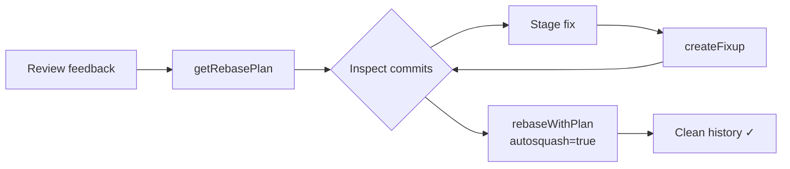
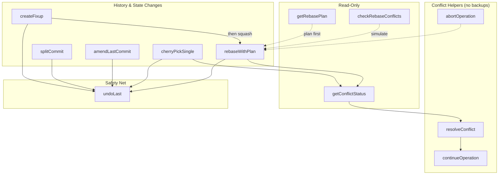

# git-hex


**AI-assisted, non-interactive git refactoring via MCP** — a focused toolset for rebase & commit perfection, usable by agents or chat users directing the MCP tools.

git-hex is an MCP (Model Context Protocol) server that provides AI assistants with safe, powerful git refactoring capabilities. It handles the complexity of interactive rebasing, fixup commits, and commit amendments while ensuring your repository is never left in a broken state.

## Features

- **Safe Rebasing**: Automatic abort on conflicts, always leaving your repo clean
- **Fixup Commits**: Create fixup! commits for later auto-squashing
- **Commit Amendments**: Safely amend the last commit with staged changes
- **Cherry-picking**: Single-commit cherry-pick with strategy options
- **Undo Support**: Backup refs for all history-mutating operations (amend, fixup, cherry-pick, rebase, split) for easy undo
- **Path Security**: All operations respect MCP roots for sandboxed access

## How It Works

### Feature Branch Cleanup Workflow

The typical git-hex workflow for cleaning up a feature branch after code review:



### Tool Overview



All history-mutating operations create backup refs, enabling `undoLast` to restore the previous state. Conflict-resolution helpers (`resolveConflict`, `continueOperation`, etc.) do not create backups.

## Requirements

- **mcp-bash framework** v0.4.0 or later
- **bash** 3.2+
- **jq** or **gojq**
- **git** 2.38+ (required for `gitHex.checkRebaseConflicts`; 2.33+ recommended if you want the `ort` merge strategy)

## Lint & Tests

- Lint shell scripts: `./test/lint.sh`
- Run all tests: `./test/run.sh` (or `./test/integration/run.sh` / `./test/security/run.sh`)
- Optional pre-commit hook to auto-run lint: `git config core.hooksPath .githooks`

## Installation

### Recommended: Wrapper Script (Auto-installs Framework)

git-hex includes a `run.sh` wrapper that auto-installs the framework if needed:

```bash
git clone https://github.com/yaniv-golan/git-hex.git ~/git-hex
cd ~/git-hex
./run.sh  # Auto-installs framework on first run
```

### Advanced: Use an Existing mcp-bash Install

If your environment already manages the mcp-bash framework and you want explicit control over the binary and env, configure your client directly:

```bash
# Clone git-hex
git clone https://github.com/yaniv-golan/git-hex.git ~/git-hex

# Ensure the framework is installed and on PATH
curl -fsSL https://raw.githubusercontent.com/yaniv-golan/mcp-bash-framework/main/install.sh | bash
```

## Claude Code Plugin

git-hex ships as a Claude Code plugin with bundled Skills.

### Installation (Claude Code)

From the parent directory of this repo:

```text
/plugin marketplace add ./git-hex
/plugin install git-hex@git-hex-marketplace
```

Or from GitHub:

```text
/plugin marketplace add yaniv-golan/git-hex
/plugin install git-hex@git-hex-marketplace
```

Bundled Skills:
- `git-hex-branch-cleanup` — history rewrite, fixups, split/reorder/squash
- `git-hex-conflict-resolution` — inspect/resolve paused rebase/cherry-pick conflicts

The MCP server auto-starts via `run.sh`; no extra client config required.

## MCP Client Configuration

### Recommended (Claude Desktop / Cursor / Windsurf)

```json
{
  "mcpServers": {
    "git-hex": {
      "command": "/path/to/git-hex/run.sh"
    }
  }
}
```

### Advanced: Use an Existing mcp-bash Install

```json
{
  "mcpServers": {
    "git-hex": {
      "command": "/path/to/mcp-bash-framework/bin/mcp-bash",
      "env": {
        "MCPBASH_PROJECT_ROOT": "/path/to/git-hex"
      }
    }
  }
}
```

### Windows (Git Bash, Wrapper Recommended)

```json
{
  "mcpServers": {
    "git-hex": {
      "command": "C:\\Program Files\\Git\\bin\\bash.exe",
      "args": ["-c", "/c/Users/me/git-hex/run.sh"],
      "env": {
        "MCPBASH_PROJECT_ROOT": "/c/Users/me/git-hex",
        "MSYS2_ARG_CONV_EXCL": "*"
      }
    }
  }
}
```

## Common Workflows

These examples show how to combine git-hex tools for typical development tasks.

### Clean Up a Feature Branch After Code Review

After receiving review feedback, create targeted fixups and squash them:

```
1. Review current commits
   → gitHex.getRebasePlan { "onto": "main" }
   
2. For each piece of feedback:
   - Make the fix in your editor
   - Stage the changes: git add <files>
   - Create a fixup targeting the original commit:
     → gitHex.createFixup { "commit": "<hash-of-commit-to-fix>" }

3. Squash all fixups into their targets:
   → gitHex.rebaseWithPlan { "onto": "main", "autosquash": true }
```

### Bring Your Branch Up to Date with Main

Rebase your feature branch onto the latest main:

```
1. First, update main:
   git checkout main && git pull

2. Switch back to your feature branch:
   git checkout feature/my-branch

3. Preview what will be rebased:
   → gitHex.getRebasePlan { "onto": "main" }

4. Perform the rebase:
   → gitHex.rebaseWithPlan { "onto": "main" }
   
   If conflicts occur, git-hex automatically aborts and restores your branch.
   Resolve conflicts manually, then retry.
```

### Quick Fix to the Last Commit

Amend the most recent commit with additional changes:

```
1. Make your changes in the editor
2. Stage them: git add <files>
3. Amend:
   → gitHex.amendLastCommit { "addAll": true }
   
   Or with a new message:
   → gitHex.amendLastCommit { "message": "Better commit message" }
```

### Cherry-Pick a Single Fix from Another Branch

Bring one specific commit to your current branch:

```
1. Find the commit hash on the source branch:
   git log other-branch --oneline

2. Cherry-pick it:
   → gitHex.cherryPickSingle { "commit": "<hash>" }
   
   If conflicts occur, git-hex aborts automatically.
```

### Undo the Last git-hex Operation

Made a mistake? Undo it:

```
→ gitHex.undoLast {}

This restores HEAD to its state before the last git-hex operation.
Works for: amendLastCommit, createFixup, rebaseWithPlan, cherryPickSingle
```

### When NOT to Use git-hex

- **On shared/protected branches** — Use on personal feature branches only
- **For hunk-level splitting** — `splitCommit` splits by file only; use `git add -p` + manual commits for line-level splits
- **On repos with contribution models you don't control** — Understand the project's rebase policy first

## Tools

### gitHex.getRebasePlan

Get a structured view of recent commits for rebase planning and inspection.

> **Note:** The `count` parameter limits how many commits are returned. When `onto` is not specified, the tool uses the upstream tracking branch if available, otherwise defaults to `HEAD~count`. This means `count` affects both the display limit *and* the default commit range. To inspect a specific range, always provide an explicit `onto` value.

**Parameters:**
| Name | Type | Required | Description |
|------|------|----------|-------------|
| `repoPath` | string | No | Path to git repository (defaults to single root) |
| `count` | integer | No | Number of commits (default: 10, max: 200) |
| `onto` | string | No | Base ref for commit range (defaults to upstream or HEAD~count) |

**Example:**
```json
{
  "repoPath": "/path/to/repo",
  "count": 5
}
```

**Returns:**
```json
{
  "success": true,
  "plan_id": "plan_1234567890_12345",
  "branch": "feature/my-branch",
  "onto": "main",
  "commits": [
    {
      "hash": "abc123...",
      "shortHash": "abc123",
      "subject": "Add feature X",
      "author": "Developer",
      "date": "2024-01-15T10:30:00Z"
    }
  ],
  "summary": "Found 1 commits on feature/my-branch since main"
}
```

### gitHex.rebaseWithPlan

Structured interactive rebase with plan support (reorder, drop, squash, reword) plus conflict pause/resume.

> **Prerequisites:** Working tree must be clean unless `autoStash=true`. All history-mutating operations create a backup ref for `undoLast`.

> **Notes:**
> - Rebases the range `onto..HEAD`
> - `plan` controls actions per commit; partial plans default missing commits to `pick`
> - `abortOnConflict=false` leaves the rebase paused so you can call `getConflictStatus` / `resolveConflict` / `continueOperation`
> - Uses native `--autostash` when `autoStash=true`

**Parameters:**
| Name | Type | Required | Description |
|------|------|----------|-------------|
| `repoPath` | string | No | Path to git repository |
| `onto` | string | **Yes** | Base ref to rebase onto |
| `plan` | array | No | Ordered list of `{action, commit, message?}` items |
| `abortOnConflict` | boolean | No | Pause on conflicts instead of aborting (default: true) |
| `autoStash` | boolean | No | Use native `--autostash` to stash/restore tracked changes (default: false) |
| `autosquash` | boolean | No | Auto-squash fixup! commits (default: true) |
| `requireComplete` | boolean | No | If true, plan must list all commits (enables reordering) |

**Example:**
```json
{
  "onto": "main",
  "autosquash": true,
  "plan": [
    { "action": "pick", "commit": "abc123" },
    { "action": "drop", "commit": "def456" }
  ]
}
```

**Returns:**
```json
{
  "success": true,
  "headBefore": "abc123...",
  "headAfter": "def456...",
  "summary": "Rebased 5 commits onto main",
  "commitsRebased": 5
}
```

### gitHex.checkRebaseConflicts

Dry-run a rebase using `git merge-tree` (Git 2.38+) without touching the worktree. Returns per-commit predictions (`clean`, `conflict`, `unknown` after the first conflict), `limitExceeded`, and a summary.

> **Git version:** Requires Git 2.38+ (uses `merge-tree --write-tree` internally, isolated in a temp object directory to avoid touching repo objects).

Key inputs: `onto` (required), `maxCommits` (default 100). Outputs are estimates only; run `getConflictStatus` after an actual pause to see real conflicts.

### Conflict Workflow

- **gitHex.getConflictStatus** — Detects whether a rebase/merge/cherry-pick is paused, which files conflict, and optional base/ours/theirs content (`includeContent`, `maxContentSize`).
- **gitHex.resolveConflict** — Marks a file as resolved (`resolution`: `keep` or `delete`, handles delete conflicts and paths with spaces).
- **gitHex.continueOperation** — Runs `rebase --continue`, `cherry-pick --continue`, or `merge --continue`, returning `completed`/`paused` with conflicting files when paused.
- **gitHex.abortOperation** — Aborts the in-progress rebase/merge/cherry-pick and restores the original state.

### gitHex.splitCommit

Split a commit into multiple commits by file (file-level only; no hunk splitting). Validates coverage of all files, rejects merge/root commits, and supports `autoStash`. Returns new commit hashes, `backupRef`, `rebasePaused` (if a later commit conflicts), and `stashNotRestored` when a pop fails.

### gitHex.createFixup

Create a fixup commit targeting a specific commit.

> **Prerequisites:** Changes must be staged (`git add`) before running. This tool commits the currently staged changes as a fixup.

**Parameters:**
| Name | Type | Required | Description |
|------|------|----------|-------------|
| `repoPath` | string | No | Path to git repository |
| `commit` | string | **Yes** | Commit hash/ref to create fixup for |
| `message` | string | No | Additional message to append |

**Example:**
```json
{
  "commit": "abc123",
  "message": "Fix typo in function name"
}
```

**Returns:**
```json
{
  "success": true,
  "headBefore": "def456...",
  "headAfter": "ghi789...",
  "targetCommit": "abc123...",
  "summary": "Created fixup commit ghi789 targeting abc123",
  "commitMessage": "fixup! Original commit message"
}
```

### gitHex.amendLastCommit

Amend the last commit with staged changes and/or a new message.

**Parameters:**
| Name | Type | Required | Description |
|------|------|----------|-------------|
| `repoPath` | string | No | Path to git repository |
| `message` | string | No | New commit message |
| `addAll` | boolean | No | Stage all tracked modified files (default: false) |

> **Note:** The `addAll` option stages only *tracked* files (`git add -u`), not new untracked files. This is a safety feature to prevent accidentally including unintended files. To include new files, stage them explicitly with `git add` before calling this tool.

**Example:**
```json
{
  "message": "Updated commit message",
  "addAll": true
}
```

**Returns:**
```json
{
  "success": true,
  "headBefore": "abc123...",
  "headAfter": "jkl012...",
  "summary": "Amended commit with new hash jkl012",
  "commitMessage": "Updated commit message"
}
```

### gitHex.cherryPickSingle

Cherry-pick a single commit with configurable merge strategy.

> **Prerequisites:** Working tree must be clean (no uncommitted changes). Commit or stash changes before running.

**Parameters:**
| Name | Type | Required | Description |
|------|------|----------|-------------|
| `repoPath` | string | No | Path to git repository |
| `commit` | string | **Yes** | Commit hash/ref to cherry-pick |
| `strategy` | string | No | Merge strategy: recursive, ort, resolve |
| `noCommit` | boolean | No | Apply without committing (default: false) |

**Example:**
```json
{
  "commit": "abc123",
  "strategy": "ort"
}
```

**Returns:**
```json
{
  "success": true,
  "headBefore": "def456...",
  "headAfter": "mno345...",
  "sourceCommit": "abc123...",
  "summary": "Cherry-picked abc123 as new commit mno345",
  "commitMessage": "Original commit subject line"
}
```

### gitHex.undoLast

Undo the last git-hex operation by resetting to the backup ref.

> **Prerequisites:** Working tree must be clean (no uncommitted changes). Commit or stash changes before running.

Every history-mutating git-hex operation (amend, fixup, rebase, split, cherry-pick) automatically creates a backup ref before making changes. This tool restores the repository to that state.

**Parameters:**
| Name | Type | Required | Description |
|------|------|----------|-------------|
| `repoPath` | string | No | Path to git repository |

**Example:**
```json
{}
```

**Returns:**
```json
{
  "success": true,
  "headBefore": "mno345...",
  "headAfter": "def456...",
  "undoneOperation": "cherryPickSingle",
  "backupRef": "git-hex/backup/1234567890_cherryPickSingle",
  "commitsUndone": 1,
  "summary": "Undid cherryPickSingle from 2024-01-15 10:30:00. Reset 1 commit(s) from mno345 to def456"
}
```

## Safety Features

git-hex is designed with safety as a priority:

1. **Conflict Handling**: All operations that can cause conflicts (rebase, cherry-pick) automatically abort and restore the repository to its original state if conflicts occur.

2. **State Validation**: Tools check for uncommitted changes, existing rebase/cherry-pick states, and other conditions before proceeding.

3. **Cleanup Traps**: Shell traps ensure cleanup happens even on unexpected errors.

4. **Path Validation**: When MCP roots are configured, all paths are validated to stay within allowed boundaries.

5. **Backup Refs**: Every history-mutating operation (amend, fixup, cherry-pick, rebase, split) creates `refs/git-hex/backup/<timestamp>_<operation>` plus a `refs/git-hex/last/<timestamp>_<operation>` pointer to the most recent one. Use `gitHex.undoLast` or `git reset --hard <backup-ref>` to restore. Conflict-resolution helpers do not create backups.

6. **Read-Only Mode**: Available for inspection-only workflows (see below).

## Read-Only Mode

For environments where you want to inspect repositories without risk of modification, enable read-only mode:

```bash
export GIT_HEX_READ_ONLY=1
```

In this mode:
- ✅ `gitHex.getRebasePlan` — allowed (inspection only)
- ❌ `gitHex.rebaseWithPlan` — blocked
- ❌ `gitHex.createFixup` — blocked
- ❌ `gitHex.amendLastCommit` — blocked
- ❌ `gitHex.cherryPickSingle` — blocked
- ❌ `gitHex.undoLast` — blocked

Blocked tools return error code `-32602` with a clear message explaining that read-only mode is active.

To configure read-only mode in your MCP client:

```json
{
  "mcpServers": {
    "git-hex": {
      "command": "/path/to/git-hex/run.sh",
      "env": {
        "GIT_HEX_READ_ONLY": "1"
      }
    }
  }
}
```

## Recovery

### Using gitHex.undoLast

The easiest way to recover from an unwanted operation:

```json
// Undo the last git-hex operation
{ "tool": "gitHex.undoLast", "arguments": {} }
```

### Using Git Reflog (Manual Recovery)

If you need to recover beyond the last operation, or if `undoLast` isn't available:

```bash
# View recent HEAD positions
git reflog

# Find the commit before the unwanted operation
# Look for entries like "rebase (start)" or your original commit

# Reset to that state
git reset --hard HEAD@{2}  # or use the commit hash
```

### Using git-hex Backup Refs

git-hex stores backup refs that persist across sessions:

```bash
# List all git-hex backup refs
git for-each-ref refs/git-hex/

# Reset to a specific backup
git reset --hard refs/git-hex/backup/1234567890_rebaseWithPlan
```

## Testing

```bash
# Validate project structure (run from project root)
cd /path/to/git-hex
mcp-bash validate

# Test a tool directly
mcp-bash run-tool gitHex.getRebasePlan --roots /path/to/test/repo --args '{"count": 5}'

# Run with MCP Inspector (must be run from project root or use ./run.sh)
cd /path/to/git-hex
npx @modelcontextprotocol/inspector --transport stdio -- mcp-bash

# Alternative: use run.sh wrapper (works from any directory)
npx @modelcontextprotocol/inspector --transport stdio -- /path/to/git-hex/run.sh
```

> **Note:** The `mcp-bash` command auto-detects the project root when run from within the git-hex directory. If running from elsewhere, either use the `./run.sh` wrapper or set `MCPBASH_PROJECT_ROOT=/path/to/git-hex`.

## Docker

```bash
docker build -t git-hex .
docker run -i --rm -v /path/to/repos:/repos git-hex
```

## License

MIT License - see [LICENSE](LICENSE) for details.

## Contributing

Contributions welcome! Please ensure:
- All tools pass `mcp-bash validate`
- New tools follow the naming convention (`gitHex.toolName`)
- Tests are included for new functionality

## Related Projects

- [mcp-bash-framework](https://github.com/yaniv-golan/mcp-bash-framework) - The MCP server framework powering git-hex
- [Model Context Protocol](https://modelcontextprotocol.io/) - The protocol specification
