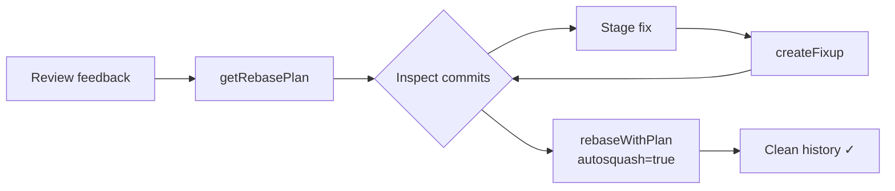
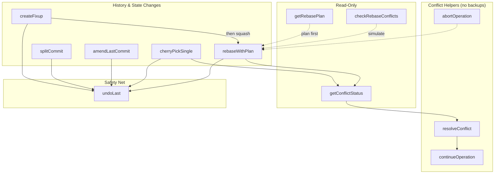

# git-hex


[](https://github.com/yaniv-golan/git-hex/actions/workflows/test.yml)

**AI-assisted, non-interactive git refactoring via MCP** — a focused toolset for rebase & commit perfection, usable by agents or chat users directing the MCP tools.

git-hex is an MCP (Model Context Protocol) server that provides AI assistants with safe, powerful git refactoring capabilities. It handles the complexity of interactive rebasing, fixup commits, and commit amendments while ensuring your repository is never left in a broken state.

Name note: “git-hex” is simply a short label for this git-history refactoring toolkit (not related to hex encoding).

See `CHANGELOG.md` for notable changes. Version metadata also lives in `VERSION` and `.claude-plugin/plugin.json`.

## Design Principles

- **Safety first**: Conflict-prone operations abort cleanly by default and create backup refs so you can always undo.
- **Deterministic git**: Focus on well-defined history rewrites (rebase, fixup, amend, split-by-file) with predictable outputs.
- **Minimal surface**: Tools only—no extra services. Everything runs through the MCP Bash Framework.
- **Respect the sandbox**: Every path is validated against MCP roots; read-only mode blocks mutating tools.
- **Agent friendly**: Outputs are structured, include summaries, and prefer explicit parameters over magic.

## MCP Spec Coverage

Targets MCP protocol **2025-11-25** (downgrades handled by the MCP Bash Framework).

| Category | Coverage | Notes |
|----------|----------|-------|
| Core | ✅ Full | Lifecycle, ping, capabilities via framework |
| Tools | ✅ Full | git-hex tool suite (see “Tools”) |
| Resources | ⚠️ Templates only | Optional file-based templates for debugging git state (requires roots) |
| Prompts | ⚠️ None | Not exposed yet (future) |
| Completions | ✅ Providers | Completion providers registered via `server.d/register.json` (full mode requires jq/gojq) |

## Client Compatibility

| Client | Status | Notes |
|--------|--------|-------|
| Claude Desktop | Tested | Use wrapper/wrapper-env on macOS |
| Claude Code/CLI | Tested | Ships as a Claude Code plugin |
| Cursor | Documented | JSON snippet below |
| Windsurf | Documented | Uses same JSON snippet |
| Windows (Git Bash) | Tested | Use wrapper; ensure paths are POSIX |

## Features

- **Safe Rebasing**: Automatic abort on conflicts so git-hex operations leave the repo clean if conflicts arise
- **Fixup Commits**: Create fixup! commits for later auto-squashing
- **Commit Amendments**: Safely amend the last commit with staged changes
- **Cherry-picking**: Single-commit cherry-pick with strategy options
- **Undo Support**: Backup refs for history-mutating operations (amend, fixup, cherry-pick, rebase, split); undo is safe unless new commits were added after the backup (see `force`)
- **Path Security**: All operations respect MCP roots for sandboxed access

## Quick Start (2 minutes)

```bash
git clone https://github.com/yaniv-golan/git-hex.git ~/git-hex
cd ~/git-hex
./git-hex.sh doctor          # ensures Bash/jq/git and framework presence
./git-hex.sh validate        # MCP project validation via the framework
# Fast smoke: list commits relative to main (adjust branch/path as needed)
./git-hex.sh run-tool git-hex-getRebasePlan --args '{"onto":"main","count":5}'
```

### 30-second end-to-end example

```bash
# Prepare staged fix for a commit, then create a fixup and autosquash
git add <files>
./git-hex.sh run-tool git-hex-createFixup --args '{"commit":"<target-sha>"}'
./git-hex.sh run-tool git-hex-rebaseWithPlan --args '{"onto":"main","autosquash":true}'
```

## How It Works

### Feature Branch Cleanup Workflow

The typical git-hex workflow for cleaning up a feature branch after code review:



### Tool Overview



All history-mutating operations create backup refs, enabling `undoLast` to restore the previous state. Conflict-resolution helpers (`resolveConflict`, `continueOperation`, etc.) do not create backups.

## Requirements

| Dependency | Version/Notes |
|------------|---------------|
| MCP Bash Framework (`mcp-bash`) | v0.8.0+ |
| bash | 3.2+ |
| jq or gojq | Required for full mode |
| git | 2.20+ (2.33+ for `ort`, 2.38+ for `git-hex-checkRebaseConflicts`) |

## Configuration

### Required

| Variable | Description |
|----------|-------------|
| `MCPBASH_PROJECT_ROOT` | Project root containing `tools/`. **Auto-set** by `git-hex.sh` and generated wrappers; required only if you invoke `mcp-bash` directly from outside the repo. |

### Optional

| Variable | Default | Description |
|----------|---------|-------------|
| `GIT_HEX_READ_ONLY` | unset | `1` blocks mutating tools (see “Read-Only Mode”) |
| `GIT_HEX_AUTO_INSTALL_FRAMEWORK` | `true` | If `true`, `git-hex.sh` auto-installs the pinned MCP Bash Framework when missing. Set to `false` to require a preinstalled framework (or use `git-hex-env.sh`). |
| `GIT_HEX_MCPBASH_SHA256` | unset | If set, `git-hex.sh` downloads the `FRAMEWORK_VERSION` tarball and verifies it against this checksum (fails on mismatch) instead of cloning. |
| `GIT_HEX_MCPBASH_ARCHIVE_URL` | unset | Optional override for the tarball URL used when `GIT_HEX_MCPBASH_SHA256` is set. |
| `MCPBASH_TOOL_ALLOWLIST` | (set by launchers) | Framework v0.7.0+: allowlisted tools may execute. The launchers set an explicit list of git-hex tool names by default (and narrow it in read-only mode). Override to `*` only for trusted environments. |

### Completions

git-hex ships completion providers (refs, commits, conflict paths) registered declaratively via `server.d/register.json`. Completions are available in full mode (jq/gojq required).

> **Tip:** Running `mcp-bash` outside this repo without `MCPBASH_PROJECT_ROOT` starts the framework’s getting-started helper, not git-hex. Use `./git-hex.sh` (CLI) or `./git-hex-env.sh` (GUI/login-shell) when launching from other directories or GUI clients.

## Versioning & Releases

- Current development version: `0.1.0` (see `VERSION`).
- No tags or GitHub releases have been published yet; pin a specific commit for reproducibility (e.g., `git checkout <commit-sha>`). We will tag v0.1.0 for release.

## Lint & Tests

- Lint shell scripts: `./test/lint.sh`
- Run all tests: `./test/run.sh` (or `./test/integration/run.sh` / `./test/security/run.sh`)
- Optional pre-commit hook to auto-run lint: `git config core.hooksPath .githooks`

## Installation

### Recommended: Wrapper Script (Auto-installs MCP Bash Framework)

git-hex includes a `git-hex.sh` wrapper that auto-installs the MCP Bash Framework if needed:

```bash
git clone https://github.com/yaniv-golan/git-hex.git ~/git-hex
cd ~/git-hex
./git-hex.sh  # Auto-installs framework on first run
```
In CI, set `GIT_HEX_MCPBASH_SHA256` (and optional `GIT_HEX_MCPBASH_ARCHIVE_URL`) to enforce a verified tarball install; otherwise the wrapper clones the tagged ref.

### Advanced: Use an Existing MCP Bash Framework Install

If your environment already manages the MCP Bash Framework and you want explicit control over the binary and env, configure your client directly (the v0.8.0 installer defaults to `~/.local/share/mcp-bash` with a symlink at `~/.local/bin/mcp-bash`). Prefer the release tarball + checksum for reproducible installs:

```bash
# Clone git-hex
git clone https://github.com/yaniv-golan/git-hex.git ~/git-hex

# Verified install (recommended): let `git-hex.sh` download the pinned release tarball and verify it.
# v0.8.0 tarball SHA256 (from the mcp-bash-framework release SHA256SUMS).
export GIT_HEX_MCPBASH_SHA256="488469bbc221b6eb9d16d6eec1d85cdd82f49ae128b30d33761e8edb9be45349"
cd ~/git-hex && ./git-hex.sh
```

#### JSON tooling and Windows/MSYS

The framework auto-detects JSON tooling (prefers `jq`, falls back to `gojq`) and includes MSYS/Git Bash guidance via `mcp-bash doctor`. No extra env is required in typical setups. If you hit Windows path/exec-limit issues, set `MCPBASH_JSON_TOOL=jq` and `MSYS2_ARG_CONV_EXCL="*"` manually.

## Claude Code Plugin

git-hex ships as a Claude Code plugin with bundled Skills.

### Installation (Claude Code)

From the parent directory of this repo:

```text
/plugin marketplace add ./git-hex
/plugin install git-hex@git-hex-marketplace
```

Or from GitHub:

```text
/plugin marketplace add yaniv-golan/git-hex
/plugin install git-hex@git-hex-marketplace
```

Bundled Skills:
- `git-hex-branch-cleanup` — history rewrite, fixups, split/reorder/squash
- `git-hex-conflict-resolution` — inspect/resolve paused rebase/cherry-pick conflicts

The MCP server auto-starts via `git-hex.sh`; no extra client config required. Skill definitions live in `skills/` and can be customized there. The Claude plugin bundle is described in `.claude-plugin/`.

## MCP Client Configuration

### Recommended (Claude Code/CLI, Cursor, Windsurf)

```json
{
  "mcpServers": {
    "git-hex": {
      "command": "/path/to/git-hex/git-hex.sh"
    }
  }
}
```

> **Roots:** Configure MCP `roots` to limit filesystem access. When only one root is configured, `repoPath` defaults to that root; passing a path outside configured roots is rejected by the framework.
> With multiple roots configured, always supply `repoPath` explicitly so the server can pick the correct repository.

**Launchers (which one to use):**
- `git-hex.sh` — default launcher. Auto-installs/pins the framework and sets `MCPBASH_PROJECT_ROOT`. Use for terminals/CLI.
- `git-hex-env.sh` — login-aware launcher (sources your login profile first, e.g., `~/.zprofile` or `~/.bash_profile`). Use for GUI clients that miss PATH/version managers (e.g., macOS Claude Desktop).
- Both expose the same commands (`./git-hex.sh validate`, `./git-hex-env.sh config --inspector`, etc.). Point your client’s `command` at whichever fits the environment.

Tips:
- From the project root, run `./git-hex.sh config --inspector` to print a ready-to-run MCP Inspector command (stdio transport) with `MCPBASH_PROJECT_ROOT` set.
- On macOS Claude Desktop, prefer `git-hex-env.sh` so PATH/version managers are loaded before starting the server.
- Claude CLI/Code: `claude mcp add --transport stdio git-hex --env MCPBASH_PROJECT_ROOT="$PWD" -- "$PWD/git-hex.sh"` (use `git-hex-env.sh` on macOS GUI shells).
- Cursor CLI: add the same JSON to `~/.cursor/mcp.json` or `.cursor/mcp.json` in a project; point `command` at the appropriate launcher.

### Advanced: Use an Existing MCP Bash Framework Install

```json
{
  "mcpServers": {
    "git-hex": {
      "command": "/path/to/.local/share/mcp-bash/bin/mcp-bash",
      "env": {
        "MCPBASH_PROJECT_ROOT": "/path/to/git-hex"
      }
    }
  }
}
```

### Windows (Git Bash, Wrapper Recommended)

```json
{
  "mcpServers": {
    "git-hex": {
      "command": "C:\\\\Program Files\\\\Git\\\\bin\\\\bash.exe",
      "args": ["-c", "/c/Users/me/git-hex/git-hex.sh"],
      "env": {
        "MCPBASH_PROJECT_ROOT": "/c/Users/me/git-hex",
        "MSYS2_ARG_CONV_EXCL": "*"
      }
    }
  }
}
```

## Common Workflows

These examples show how to combine git-hex tools for typical development tasks.

### Clean Up a Feature Branch After Code Review

After receiving review feedback, create targeted fixups and squash them:

```
1. Review current commits
   → git-hex-getRebasePlan { "onto": "main" }
   
2. For each piece of feedback:
   - Make the fix in your editor
   - Stage the changes: git add <files>
   - Create a fixup targeting the original commit:
     → git-hex-createFixup { "commit": "<hash-of-commit-to-fix>" }

3. Squash all fixups into their targets:
   → git-hex-rebaseWithPlan { "onto": "main", "autosquash": true }
```

### Bring Your Branch Up to Date with Main

Rebase your feature branch onto the latest main:

```
1. First, update main:
   git checkout main && git pull

2. Switch back to your feature branch:
   git checkout feature/my-branch

3. Preview what will be rebased:
   → git-hex-getRebasePlan { "onto": "main" }

4. Perform the rebase:
   → git-hex-rebaseWithPlan { "onto": "main" }
   
   If conflicts occur, git-hex automatically aborts and restores your branch.
   Resolve conflicts manually, then retry.
```

### Quick Fix to the Last Commit

Amend the most recent commit with additional changes:

```
1. Make your changes in the editor
2. Stage them: git add <files>
3. Amend:
   → git-hex-amendLastCommit { "addAll": true }
   
   Or with a new message:
   → git-hex-amendLastCommit { "message": "Better commit message" }
```

### Cherry-Pick a Single Fix from Another Branch

Bring one specific commit to your current branch:

```
1. Find the commit hash on the source branch:
   git log other-branch --oneline

2. Cherry-pick it:
   → git-hex-cherryPickSingle { "commit": "<hash>" }
   
   If conflicts occur, git-hex aborts automatically.
```

### Undo the Last git-hex Operation

Made a mistake? Undo it:

```
→ git-hex-undoLast {}

This restores HEAD to its state before the last git-hex operation.
Works for: amendLastCommit, createFixup, rebaseWithPlan, cherryPickSingle
```

### When NOT to Use git-hex

- **On shared/protected branches** — Use on personal feature branches only
- **For hunk-level splitting** — `splitCommit` splits by file only; use `git add -p` + manual commits for line-level splits
- **On repos with contribution models you don't control** — Understand the project's rebase policy first

## Tools

### git-hex-getRebasePlan

Get a structured view of recent commits for rebase planning and inspection.

> **Note:** The `count` parameter limits how many commits are returned. When `onto` is not specified, the tool uses the upstream tracking branch if available, otherwise defaults to `HEAD~count`. This means `count` affects both the display limit *and* the default commit range. To inspect a specific range, always provide an explicit `onto` value.
> For single-commit repositories, the default base is the empty tree so the lone commit is included. To avoid surprises when a branch has an upstream, set both `onto` (e.g., `main`) and `count` (for display only).

**Parameters:**
| Name | Type | Required | Description |
|------|------|----------|-------------|
| `repoPath` | string | No | Path to git repository (defaults to single root) |
| `count` | integer | No | Number of commits (default: 10, max: 200) |
| `onto` | string | No | Base ref for commit range (defaults to upstream or HEAD~count) |

**Example:**
```json
{
  "repoPath": "/path/to/repo",
  "count": 5
}
```

**Returns:**
```json
{
  "success": true,
  "plan_id": "plan_1234567890_12345",
  "branch": "feature/my-branch",
  "onto": "main",
  "commits": [
    {
      "hash": "abc123...",
      "shortHash": "abc123",
      "subject": "Add feature X",
      "author": "Developer",
      "date": "2024-01-15T10:30:00Z"
    }
  ],
  "summary": "Found 1 commits on feature/my-branch since main"
}
```

### git-hex-rebaseWithPlan

Structured interactive rebase with plan support (reorder, drop, squash, reword) plus conflict pause/resume.

> **Prerequisites:** Working tree must be clean unless `autoStash=true`. All history-mutating operations create a backup ref for `undoLast`.

> **Notes:**
> - Rebases the range `onto..HEAD`
> - `plan` controls actions per commit; partial plans default missing commits to `pick`
> - `abortOnConflict=false` leaves the rebase paused so you can call `getConflictStatus` / `resolveConflict` / `continueOperation`
> - Uses native `--autostash` when `autoStash=true`

**Parameters:**
| Name | Type | Required | Description |
|------|------|----------|-------------|
| `repoPath` | string | No | Path to git repository |
| `onto` | string | **Yes** | Base ref to rebase onto |
| `plan` | array | No | Ordered list of `{action, commit, message?}` items |
| `abortOnConflict` | boolean | No | Abort on conflicts (default: true). Set to false to pause and resolve instead of auto-aborting. |
| `autoStash` | boolean | No | Use native `--autostash` to stash/restore tracked changes (default: false) |
| `autosquash` | boolean | No | Auto-squash fixup! commits (default: true) |
| `requireComplete` | boolean | No | If true, plan must list all commits (enables reordering) |

**Example:**
```json
{
  "onto": "main",
  "autosquash": true,
  "plan": [
    { "action": "pick", "commit": "abc123" },
    { "action": "drop", "commit": "def456" }
  ]
}
```

**Returns:**
```json
{
  "success": true,
  "headBefore": "abc123...",
  "headAfter": "def456...",
  "summary": "Rebased 5 commits onto main",
  "commitsRebased": 5
}
```

### git-hex-checkRebaseConflicts

Dry-run a rebase using `git merge-tree` (Git 2.38+) without touching the worktree. Returns per-commit predictions (`clean`, `conflict`, `unknown` after the first conflict), `limitExceeded`, and a summary.

> **Git version:** Requires Git 2.38+ (uses `merge-tree --write-tree` internally, isolated in a temp object directory to avoid touching repo objects).

Key inputs: `onto` (required), `maxCommits` (default 100). Outputs are estimates only; run `getConflictStatus` after an actual pause to see real conflicts.

**Example output:**
```json
{
  "success": true,
  "wouldConflict": true,
  "confidence": "estimate",
  "commits": [
    { "hash": "8b3f1c2", "subject": "Clean change", "prediction": "clean" },
    { "hash": "a1b2c3d", "subject": "Conflicting change", "prediction": "conflict" },
    { "hash": "c4d5e6f", "subject": "After conflict", "prediction": "unknown" }
  ],
  "limitExceeded": false,
  "totalCommits": 3,
  "checkedCommits": 3,
  "summary": "Rebase would conflict at commit 2/3 (a1b2c3d)",
  "note": "Predictions may not match actual rebase behavior in all cases"
}
```

### Conflict Workflow

- **git-hex-getConflictStatus** — Detects whether a rebase/merge/cherry-pick is paused, which files conflict, and optional base/ours/theirs content (`includeContent`, `maxContentSize`).
- **git-hex-resolveConflict** — Marks a file as resolved (`resolution`: `keep` or `delete`, handles delete conflicts and paths with spaces).
- **git-hex-continueOperation** — Runs `rebase --continue`, `cherry-pick --continue`, or `merge --continue`, returning `completed`/`paused` with conflicting files when paused.
- **git-hex-abortOperation** — Aborts the in-progress rebase/merge/cherry-pick and restores the original state.

**getConflictStatus example output:**
```json
{
  "success": true,
  "conflictType": "rebase",
  "currentStep": 1,
  "totalSteps": 3,
  "conflictingFiles": [
    {
      "path": "conflict.txt",
      "conflictType": "both_modified"
    }
  ],
  "paused": true,
  "summary": "Rebase paused with conflicts"
}
```

### git-hex-splitCommit

Split a commit into multiple commits by file (file-level only; no hunk splitting). Validates coverage of all files, rejects merge/root commits, and supports `autoStash`. Returns new commit hashes, `backupRef`, `rebasePaused` (if a later commit conflicts), and `stashNotRestored` when a pop fails.

**Parameters:**
| Name | Type | Required | Description |
|------|------|----------|-------------|
| `repoPath` | string | No | Path to git repository (defaults to single root) |
| `commit` | string | **Yes** | Commit hash/ref to split (must be ancestor of HEAD, non-merge, non-root) |
| `splits` | array | **Yes** | Array of `{ files: [...], message: "<single-line>" }` (min 2) |
| `autoStash` | boolean | No | Automatically stash/restore uncommitted changes (default: false) |

**Returns:**
```json
{
  "success": true,
  "originalCommit": "abc123...",
  "newCommits": [
    { "hash": "def456...", "message": "Split part 1", "files": ["file1.txt"] },
    { "hash": "789abcd...", "message": "Split part 2", "files": ["file2.txt"] }
  ],
  "backupRef": "git-hex/backup/1700000000_splitCommit_xxx",
  "rebasePaused": false,
  "stashNotRestored": false,
  "summary": "Split abc1234 into 2 commits"
}
```

### git-hex-createFixup

Create a fixup commit targeting a specific commit.

> **Prerequisites:** Changes must be staged (`git add`) before running. This tool commits the currently staged changes as a fixup.

**Parameters:**
| Name | Type | Required | Description |
|------|------|----------|-------------|
| `repoPath` | string | No | Path to git repository |
| `commit` | string | **Yes** | Commit hash/ref to create fixup for |
| `message` | string | No | Additional message to append |

**Example:**
```json
{
  "commit": "abc123",
  "message": "Fix typo in function name"
}
```

**Returns:**
```json
{
  "success": true,
  "headBefore": "def456...",
  "headAfter": "ghi789...",
  "targetCommit": "abc123...",
  "summary": "Created fixup commit ghi789 targeting abc123",
  "commitMessage": "fixup! Original commit message"
}
```

### git-hex-amendLastCommit

Amend the last commit with staged changes and/or a new message.

**Parameters:**
| Name | Type | Required | Description |
|------|------|----------|-------------|
| `repoPath` | string | No | Path to git repository |
| `message` | string | No | New commit message |
| `addAll` | boolean | No | Stage all tracked modified files (default: false) |

> **Note:** The `addAll` option stages only *tracked* files (`git add -u`), not new untracked files. This is a safety feature to prevent accidentally including unintended files. To include new files, stage them explicitly with `git add` before calling this tool.

**Example:**
```json
{
  "message": "Updated commit message",
  "addAll": true
}
```

**Returns:**
```json
{
  "success": true,
  "headBefore": "abc123...",
  "headAfter": "jkl012...",
  "summary": "Amended commit with new hash jkl012",
  "commitMessage": "Updated commit message"
}
```

### git-hex-cherryPickSingle

Cherry-pick a single commit with configurable merge strategy.

> **Prerequisites:** Working tree must be clean (no uncommitted changes) unless `autoStash=true`, which stashes/restore tracked changes automatically. Commit or stash changes before running otherwise.

**Parameters:**
| Name | Type | Required | Description |
|------|------|----------|-------------|
| `repoPath` | string | No | Path to git repository |
| `commit` | string | **Yes** | Commit hash/ref to cherry-pick |
| `strategy` | string | No | Merge strategy: recursive, ort, resolve |
| `noCommit` | boolean | No | Apply without committing (default: false) |
| `abortOnConflict` | boolean | No | If false, pause on conflicts instead of aborting (default: true) |
| `autoStash` | boolean | No | Automatically stash/restore tracked changes (requires `abortOnConflict=true`, default: false) |

**Example:**
```json
{
  "commit": "abc123",
  "strategy": "ort",
  "abortOnConflict": true,
  "autoStash": true
}
```

**Returns:**
```json
{
  "success": true,
  "headBefore": "def456...",
  "headAfter": "mno345...",
  "sourceCommit": "abc123...",
  "summary": "Cherry-picked abc123 as new commit mno345",
  "commitMessage": "Original commit subject line"
}
```

### git-hex-undoLast

Undo the last git-hex operation by resetting to the backup ref.

> **Prerequisites:** Working tree must be clean (no uncommitted changes). Commit or stash changes before running.

Every history-mutating git-hex operation (amend, fixup, rebase, split, cherry-pick) automatically creates a backup ref before making changes. This tool restores the repository to that state.

**Parameters:**
| Name | Type | Required | Description |
|------|------|----------|-------------|
| `repoPath` | string | No | Path to git repository |

**Example:**
```json
{}
```

**Returns:**
```json
{
  "success": true,
  "headBefore": "mno345...",
  "headAfter": "def456...",
  "undoneOperation": "cherryPickSingle",
  "backupRef": "git-hex/backup/1234567890_cherryPickSingle",
  "commitsUndone": 1,
  "summary": "Undid cherryPickSingle from 2024-01-15 10:30:00. Reset 1 commit(s) from mno345 to def456"
}
```

## Safety Features

git-hex is designed with safety as a priority:

1. **Conflict Handling**: All operations that can cause conflicts (rebase, cherry-pick) automatically abort and restore the repository to its original state if conflicts occur.

2. **State Validation**: Tools check for uncommitted changes, existing rebase/cherry-pick states, and other conditions before proceeding.

3. **Cleanup Traps**: Shell traps ensure cleanup happens even on unexpected errors.

4. **Path Validation**: When MCP roots are configured, all paths are validated to stay within allowed boundaries.

5. **Backup Refs**: Every history-mutating operation (amend, fixup, cherry-pick, rebase, split) creates `refs/git-hex/backup/<timestamp>_<operation>` plus a `refs/git-hex/last/<timestamp>_<operation>` pointer to the most recent one. Use `git-hex-undoLast` or `git reset --hard <backup-ref>` to restore. Conflict-resolution helpers do not create backups.

6. **Read-Only Mode**: Available for inspection-only workflows (see below).

## Read-Only Mode

For environments where you want to inspect repositories without risk of modification, enable read-only mode:

```bash
export GIT_HEX_READ_ONLY=1
```

In this mode:
- ✅ `git-hex-getRebasePlan` — allowed (inspection only)
- ❌ `git-hex-rebaseWithPlan` — blocked
- ❌ `git-hex-createFixup` — blocked
- ❌ `git-hex-amendLastCommit` — blocked
- ❌ `git-hex-cherryPickSingle` — blocked
- ❌ `git-hex-undoLast` — blocked

Blocked tools return error code `-32602` with a clear message explaining that read-only mode is active.

To configure read-only mode in your MCP client:

```json
{
  "mcpServers": {
    "git-hex": {
      "command": "/path/to/git-hex/git-hex.sh",
      "env": {
        "GIT_HEX_READ_ONLY": "1"
      }
    }
  }
}
```

## Recovery

### Using git-hex-undoLast

The easiest way to recover from an unwanted operation:

```json
// Undo the last git-hex operation
{ "tool": "git-hex-undoLast", "arguments": {} }
```

> `undoLast` refuses to run if new commits were added after the backup ref; set `force` to `true` to discard those commits explicitly.

### Using Git Reflog (Manual Recovery)

If you need to recover beyond the last operation, or if `undoLast` isn't available:

```bash
# View recent HEAD positions
git reflog

# Find the commit before the unwanted operation
# Look for entries like "rebase (start)" or your original commit

# Reset to that state
git reset --hard HEAD@{2}  # or use the commit hash
```

### Using git-hex Backup Refs

git-hex stores backup refs that persist across sessions:

```bash
# List all git-hex backup refs
git for-each-ref refs/git-hex/

# Reset to a specific backup
git reset --hard refs/git-hex/backup/1234567890_rebaseWithPlan
```

## Testing

```bash
# Validate project structure (run from project root)
cd /path/to/git-hex
mcp-bash validate

# Test a tool directly
mcp-bash run-tool git-hex-getRebasePlan --roots /path/to/test/repo --args '{"count": 5}'

# Run with MCP Inspector (must be run from project root or use ./git-hex.sh)
cd /path/to/git-hex
npx @modelcontextprotocol/inspector --transport stdio -- mcp-bash

# Alternative: use git-hex.sh wrapper (works from any directory)
npx @modelcontextprotocol/inspector --transport stdio -- /path/to/git-hex/git-hex.sh
```

> **Note:** The MCP Bash Framework CLI (`mcp-bash`) auto-detects the project root when run from within the git-hex directory. If running from elsewhere, either use the `./git-hex.sh` wrapper or set `MCPBASH_PROJECT_ROOT=/path/to/git-hex`.

## Diagnostics & Health

- Project validation: `./git-hex.sh validate` (or `mcp-bash validate` from the repo)
- Ready check: `./git-hex.sh --health` (stdio exit code: `0` ready, `1` unhealthy, `2` misconfigured)
- Debug a single tool without starting MCP: `./git-hex.sh run-tool <tool> --args '{}' --roots <repo>`
- Backup inventory: `git for-each-ref refs/git-hex/`

## Docker

```bash
docker build -t git-hex .
docker run -i --rm -v /path/to/repo:/repo git-hex --roots /repo
```

Pass MCP roots and the target repo explicitly when running the container (examples):

- With MCP Inspector:
  ```bash
  docker run -i --rm -v /path/to/repo:/repo git-hex --roots /repo
  ```
- With a client config that starts the server:
  ```json
  {
    "mcpServers": {
      "git-hex": {
        "command": "docker",
        "args": ["run", "-i", "--rm", "-v", "/path/to/repo:/repo", "git-hex", "--roots", "/repo"]
      }
    }
  }
  ```

`repoPath` must be within a configured root; pass it explicitly when you mount multiple repositories.

## Troubleshooting

- `undoLast` fails because of new commits: re-run with `"force": true` if you intend to discard the commits added after the git-hex operation. If a rebase/merge/cherry-pick is paused, resolve/abort it first.
- Stuck rebase/cherry-pick: run `git-hex-getConflictStatus`, resolve files, then `git-hex-continueOperation`; if you want to abandon, use `git-hex-abortOperation`.
- MCP connectivity or repo path errors: ensure `repoPath` is inside your configured `roots` and that the repo is clean when required (see tool prerequisites).

## Documentation Map

- Tool reference: this README (see “Tools”).
- Skills: `skills/git-hex-branch-cleanup/SKILL.md`, `skills/git-hex-conflict-resolution/SKILL.md`.
- CHANGELOG: `CHANGELOG.md`.
- Internal design/plan docs: `docs/internal/`.
- Plugin metadata: `.claude-plugin/`.
- Server policy and metadata: `server.d/`.

## MCP Details

- Capabilities: git-hex exposes MCP tools, completion providers, and optional file-based resource templates under `resources/` for debugging git state (no MCP `prompts` yet).
- Error codes: invalid arguments and read-only mode blocks use `-32602`; unexpected failures use `-32603`. Tool summaries include human-readable hints.
- Read-only mode: controlled by `GIT_HEX_READ_ONLY=1` (see “Read-Only Mode”).
- Initialization: uses the MCP Bash Framework defaults; capability negotiation simply advertises the tool list.

### Using with MCP clients

Minimal stdio configuration (client JSON varies; start with the wrapper and add roots per your client):
```json
{
  "mcpServers": {
    "git-hex": {
      "command": "/path/to/git-hex/git-hex.sh"
    }
  }
}
```

If launching from a GUI login shell on macOS, prefer `git-hex-env.sh` so PATH/env matches your login shell. Always configure your client’s `roots`/`allowedRoots` (name varies by client) to the repositories you want the tools to touch.

### Environment flags

| Variable | Default | Effect |
|----------|---------|--------|
| `MCPBASH_PROJECT_ROOT` | (auto when running `git-hex.sh`) | Path to this repo; required if you invoke `mcp-bash` directly. |
| `GIT_HEX_READ_ONLY` | unset | `1` blocks mutating tools (read-only mode). |
| `GIT_HEX_DEBUG` | unset | `true` enables shell tracing in tools. |
| `GIT_HEX_DEBUG_SPLIT` | unset | `true` dumps splitCommit debug JSON to `${TMPDIR:-/tmp}/git-hex-split-debug.json`. |
| `MCPBASH_CI_MODE` | unset | `1` uses CI-safe defaults in tests (set automatically in CI). |
| `MCPBASH_TRACE_TOOLS` | unset | Set to enable per-command tracing in tools (see `MCPBASH_TRACE_PS4`). |

## Security

See `SECURITY.md` for how to report vulnerabilities.

## License

MIT License - see [LICENSE](LICENSE) for details.

## Contributing

Contributions welcome! Please ensure:
- All tools pass `mcp-bash validate` (MCP Bash Framework CLI)
- New tools follow the naming convention (`git-hex-toolName`)
- Tests are included for new functionality

## Related Projects

- [mcp-bash-framework](https://github.com/yaniv-golan/mcp-bash-framework) - The MCP server framework powering git-hex
- [Model Context Protocol](https://modelcontextprotocol.io/) - The protocol specification
